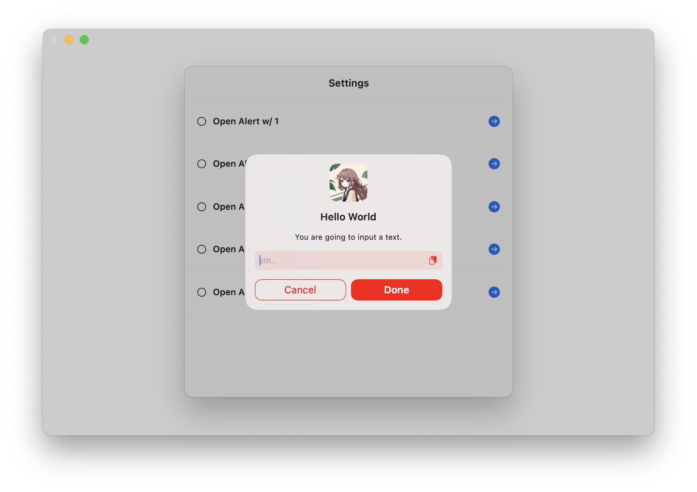

# AlertController

A modern, customizable alert controller implementation for iOS and macCatalyst applications.



## Features

- Custom styled alert views with clean UI
- Support for iOS and macCatalyst platforms
- Multiple action buttons with customizable styles (normal and dangerous)
- We handles dismiss and callback for you
- Text input support with clipboard integration
- Progress indicator for loading states
- Customizable accent colors and appearance
- Smooth animations with spring effects
- Escape key and outside tap dismissal options
- Localization support

## Usage

### Basic Alert

```swift
let alert = AlertViewController(
    title: "Hello World",
    message: "This is a sample alert message"
) { context in
    context.addAction(title: "Cancel") {
        context.dispose()
    }
    context.addAction(title: "Confirm", attribute: .dangerous) {
        context.dispose {
            // Your code here after confirmation
        }
    }
}
present(alert, animated: true)
```

### Input Alert

```swift
let alert = AlertInputViewController(
    title: "Hello World",
    message: "You are going to input a text.",
    placeholder: "sth...",
    text: ""
) { text in print(text) }
present(alert, animated: true)
```

### Progress Indicator

```swift
let alert = AlertProgressIndicatorViewController(
    title: "Hello World",
    message: "This is a message from alert."
)
present(alert, animated: true)
DispatchQueue.main.asyncAfter(deadline: .now() + 2) {
    alert.dismiss(animated: true)
}
```

## Customization

You can customize the appearance of alerts using the `AlertControllerConfiguration`:

```swift
// Set custom accent color
AlertControllerConfiguration.accentColor = .systemBlue

// Set custom image to display at the top of alerts
AlertControllerConfiguration.alertImage = UIImage(named: "YourImage")
```

## Requirements

- iOS 15.0+ / macCatalyst 15.0+
- Swift 5.9+

## Installation

### Swift Package Manager

Add the following to your `Package.swift` dependencies:

```swift
dependencies: [
    .package(url: "https://github.com/Lakr233/AlertController.git", from: "1.0.0")
]
```

## License

AlertController is available under the MIT license. See the [LICENSE](LICENSE) file for more info.

---

Copyright © 2025 Lakr Aream. All rights reserved.
