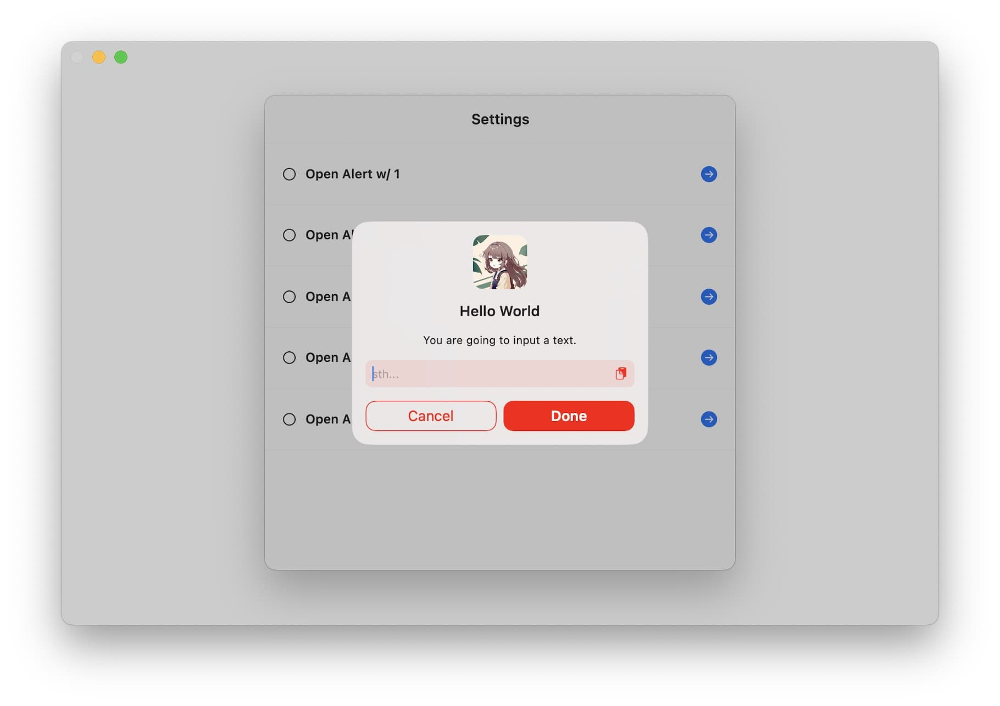

# AlertController

A modern, customizable alert controller implementation for iOS and macCatalyst applications.



## Features

- Custom styled alert views with clean UI
- Support for iOS and macCatalyst platforms
- Multiple action buttons with customizable styles
- Automatic promotion of the last action when no accent action is provided
- Adaptive two-button layout that switches to vertical when titles wrap
- Dismiss and callback handling built in
- Text input support with clipboard integration
- Progress indicator for loading states
- Animated progress text with crossfade transitions
- Customizable accent colors and appearance
- Smooth animations with spring effects
- Escape key and outside tap dismissal options
- Localization support

## Installation

### Swift Package Manager

Add the following to your `Package.swift` dependencies:

```swift
dependencies: [
    .package(url: "https://github.com/Lakr233/AlertController.git", from: "2.2.1")
]
```

## Usage

### Basic Alert

```swift
let alert = AlertViewController(
    title: "Hello World",
    message: "This is a sample alert message"
) { context in
    context.addAction(title: "Cancel") {
        context.dispose()
    }
    context.addAction(title: "Confirm", attribute: .accent) {
        context.dispose {
            // Your code here after confirmation
        }
    }
}
present(alert, animated: true)
```

If no action is marked with `.accent`, the last action is automatically promoted.

### Input Alert

```swift
let alert = AlertInputViewController(
    title: "Hello World",
    message: "You are going to input a text.",
    placeholder: "sth...",
    text: ""
) { text in print(text) }
present(alert, animated: true)
```

### Progress Indicator

```swift
let alert = AlertProgressIndicatorViewController(
    title: "Hello World",
    message: ""
)
present(alert, animated: true)
Task { @MainActor in
    try? await Task.sleep(for: .seconds(1))
    alert.progressContext.purpose(message: "Lorem ipsum dolor sit amet.")
    try? await Task.sleep(for: .seconds(1))
    alert.progressContext.purpose(message: "")
    try? await Task.sleep(for: .seconds(1))
    alert.progressContext.purpose(message: "Sed do eiusmod tempor incididunt ut labore et dolore magna aliqua.")
    try? await Task.sleep(for: .seconds(1))
    alert.dismiss(animated: true)
}
```

`progressContext.purpose(message:)` updates the message in place with animated text transitions and supports multiline content.

## Customization

You can customize the appearance of alerts using the `AlertControllerConfiguration`:

```swift
// Set custom accent color
AlertControllerConfiguration.accentColor = .systemBlue

// Set custom image to display at the top of alerts
AlertControllerConfiguration.alertImage = UIImage(named: "YourImage")
```

## Build

Verified build entry points:

- `xcodebuild -scheme AlertController -destination 'generic/platform=iOS Simulator' build`
- `xcodebuild -scheme AlertController -destination 'platform=macOS,variant=Mac Catalyst' build`
- `xcodebuild -workspace Example/AlertExample.xcworkspace -scheme AlertExample -destination 'generic/platform=iOS Simulator' build`
- `xcodebuild -workspace Example/AlertExample.xcworkspace -scheme AlertExample -destination 'platform=macOS,variant=Mac Catalyst' build`

## Requirements

- iOS 15.0+ / macCatalyst 15.0+
- Swift 5.9+

## License

AlertController is available under the MIT license. See the [LICENSE](LICENSE) file for more info.

---

Copyright © 2025 Lakr Aream. All rights reserved.
